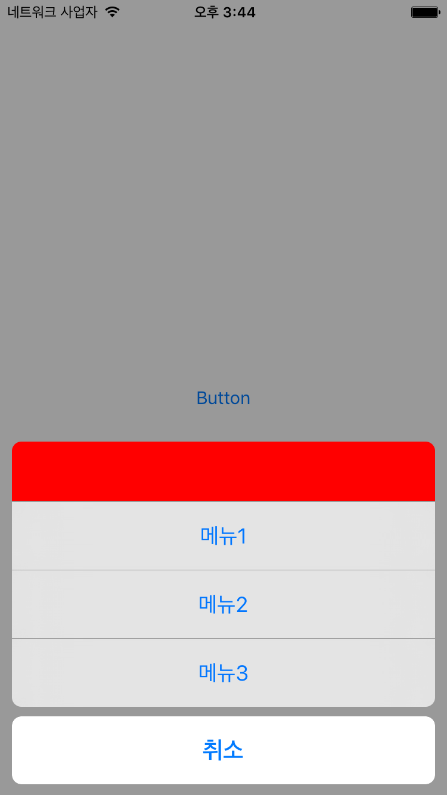

# KUIActionSheet
> Custom UIActionSheet for Swift



## Example
To run the example project, clone the repo, and run `pod install` from the Example directory first.

## Installation

#### CocoaPods
KUIActionSheet is available through [CocoaPods](http://cocoapods.org). To install
it, simply add the following line to your Podfile:

```ruby
pod "KUIActionSheet"
```

## Usage

#### KUIActionSheet
```Swift 
import KUIActionSheet

let actionSheet = KUIActionSheet.view(parentViewController: self)

actionSheet?.add(customView: UIView<KUIActionSheetItemViewProtocol>)
actionSheet?.add(item: KUIActionSheetItem(title: "Menu1", destructive: false) { [weak self] (item) in
  print(item.title)
})
actionSheet?.show()

```

#### CustomView
```Swift 
class CustomView: UIView, KUIActionSheetItemViewProtocol {
    
    func ... () {
      actionSheet?.dismiss()
    }
}

```

#### CustomTheme
```Swift 
public protocol KUIActionSheetProtocol {
    var backgroundColor: UIColor { get }
    var animationDuration: NSTimeInterval { get }
    var blurEffectStyle: UIBlurEffectStyle { get }
    var itemTheme: KUIActionSheetItemTheme { get }
}

public protocol KUIActionSheetItemTheme {
    var height: CGFloat { get }
    var font: UIFont { get }
    var titleColor: UIColor { get }
    var destructiveTitleColor: UIColor { get }
}

```

## Authors

Taeun Kim (kofktu), <kofktu@gmail.com>

## Requirements

- iOS 8.0+
- Xcode 7.3

## License

KUIActionSheet is available under the ```MIT``` license. See the ```LICENSE``` file for more info.
